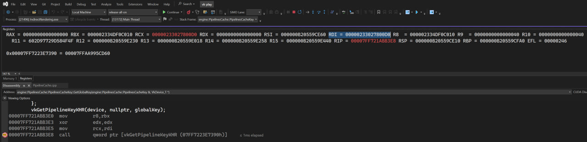
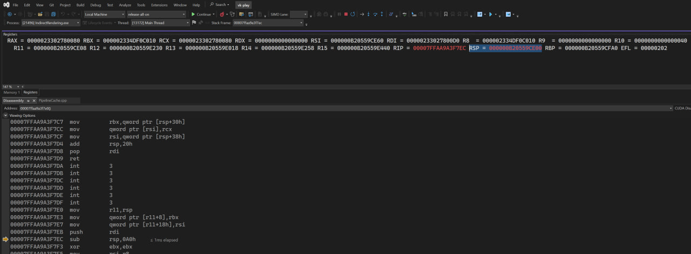
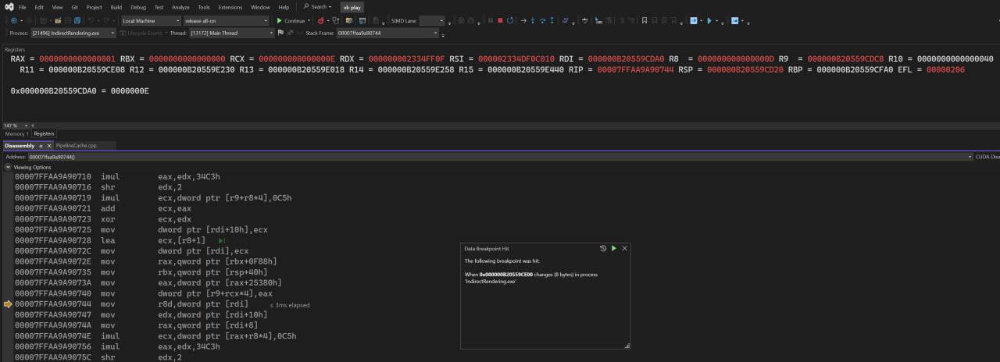
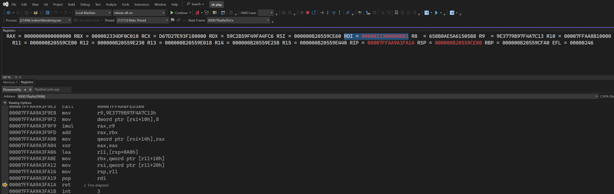
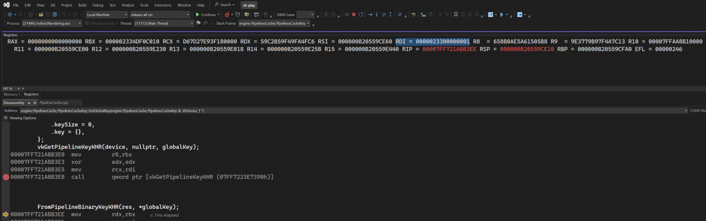

## Minimal reproducible example

https://forums.developer.nvidia.com/t/possible-stack-buffer-overflow-by-1-caused-overwrite-callee-saved-register-in-vkgetpipelinekeykhr-when-ppipelinecreateinfo-nullptr-get-global-key/373306

## TL;DR

```
/*
MASM implementation:

.code
GetRDI proc
    mov rax, rdi
    ret
GetRDI endp
end
 */
extern "C" uint64_t GetRDI();

int main() {
    const VkAllocationCallbacks* pAllocator = nullptr;
    constexpr const char* kVulkanDllName = "vulkan-1.dll";
    HMODULE vulkanModule = LoadLibraryA(kVulkanDllName);
    const auto vkGetInstanceProcAddr = reinterpret_cast<PFN_vkGetInstanceProcAddr>(GetProcAddress(vulkanModule, "vkGetInstanceProcAddr"));
    const auto instance = CreateInstance(vkGetInstanceProcAddr, pAllocator, /* enableValidationLayers= */ VALIDATION_LAYERS_ENABLED);
    const auto debugMessenger = VALIDATION_LAYERS_ENABLED ? CreateDebugUtilsMessengerEXT(vkGetInstanceProcAddr, instance, pAllocator) : VK_NULL_HANDLE;
    const auto physicalDevice = GetPhysicalDevice(vkGetInstanceProcAddr, instance);
    const auto queueFamilyIndex = 0;
    const auto device = CreateDevice(vkGetInstanceProcAddr, instance, physicalDevice, queueFamilyIndex, pAllocator);
    const auto vkGetDeviceProcAddr = reinterpret_cast<PFN_vkGetDeviceProcAddr>(vkGetInstanceProcAddr(instance, "vkGetDeviceProcAddr"));


    const auto vkGetPipelineKeyKHR = reinterpret_cast<PFN_vkGetPipelineKeyKHR>(vkGetDeviceProcAddr(device, "vkGetPipelineKeyKHR"));
    VkPipelineBinaryKeyKHR globalKey{
		.sType = VK_STRUCTURE_TYPE_PIPELINE_BINARY_KEY_KHR,
		.pNext = nullptr,
		.keySize = 0,
		.key = {},
	};
    const auto RDIBeforeCall = GetRDI();
    vkGetPipelineKeyKHR(device, nullptr, &globalKey);
    const auto RDIAfterCall = GetRDI();
    std::printf("Before: 0x%016llx\nAfter:  0x%016llx\n", RDIBeforeCall, RDIAfterCall);
```

## Requirements

- cmake 3.31 or newer
- c++20 compiler (only msvc tested)
- vulkan headers (only Vulkan SDK 1.4.350 tested)

## Build steps

From project root directory:

```
mkdir build
cmake -S . -B ./build
cmake --build ./build
./build/Debug/pipeline_binary_get_global_key_mre.exe
```

## Sample output

```
alexs@DESKTOP-TCAEACT MINGW64 ~/source/repos/alkut/pipeline_binary_get_global_key_mre (master)
$ ./build/Debug/pipeline_binary_get_global_key_mre.exe
Before: 0x000000cc23eff6e0
After:  0x000000cc00000001
```

## From Vulkan specification

https://registry.khronos.org/vulkan/specs/latest-ratified/pdf/vkspec.pdf

Vulkan®
 1.4.354 - A Specification (with
all ratified extensions)
The Khronos®
 Vulkan Working Group
Version 1.4.354, 2026-06-11 23:43:35Z: from git branch: github-main commit:
ea5259d68356334a2928d5d6c327ccaea2f2af08

> 10.9.1. Generating the Pipeline Key
To generate the key for a particular pipeline creation info, call:
// Provided by VK_KHR_pipeline_binary
VkResult vkGetPipelineKeyKHR(
  VkDevice device,
  const VkPipelineCreateInfoKHR* pPipelineCreateInfo,
  VkPipelineBinaryKeyKHR* pPipelineKey);
• device is the logical device that creates the pipeline object.
• pPipelineCreateInfo is NULL or a pointer to a VkPipelineCreateInfoKHR structure.
• pPipelineKey is a pointer to a VkPipelineBinaryKeyKHR structure in which the resulting key is
returned.
If pPipelineCreateInfo is NULL, then the implementation must return the global key that applies to
all pipelines. If the key obtained in this way changes between saving and restoring data obtained
from vkGetPipelineBinaryDataKHR in a different VkDevice, then the application must assume that
the restored data is invalid and cannot be passed to vkCreatePipelineBinariesKHR. Otherwise the
application can assume the data is still valid.

## From Vulkan documentation

https://docs.vulkan.org/features/latest/features/proposals/VK_KHR_pipeline_binary.html#_examples

> 4. Examples
The following examples illustrate using an application defined cache to lookup binaries; any constraints or features of that caching system can be expressed within the application cache itself.

4.1. Retrieving the global key
// Get the global key
VkPipelineBinaryKeyKHR globalKey;
globalKey.sType = VK_STRUCTURE_TYPE_PIPELINE_BINARY_KEY_KHR;
vkGetPipelineKeyKHR(device, NULL, &globalKey);

// This can be used to ensure the app's cache is valid.

## Debug screenshots

Just before call vkGetPipelineKeyKHR

RDI = 0x00000233027800D0



Function saved RDI on stack (push rdi)

RSP = 0x000000B20559CE00

Add data breakpoint to that memory location with data size = 8 bytes



The following breakpoint was hit:

When 0x000000B20559CE00 changes (8 bytes) in process ‘IndirectRendering.exe’

Intruction

00007FFAA9A90740 mov dword ptr [r9+rcx*4],eax

From the last iteration of fully unrolled cycle writes to the stack location, where rdi was saved. RAX = 0x01, EAX = 0x01 - exact same number as in corrupted RDI.



pop rdi
ret

Get corrupted RDI from stack:
0x00000233027800D0 -> 0x0000023300000001

The most significant 32 bit the same: 0x00000233
The least significant 32 bit overwrtiten to 0x00000001



Finally, call vkGetPipelineKeyKHR changed callee-saved RDI
0x00000233027800D0 -> 0x0000023300000001
causing segmentation fault afterwards


